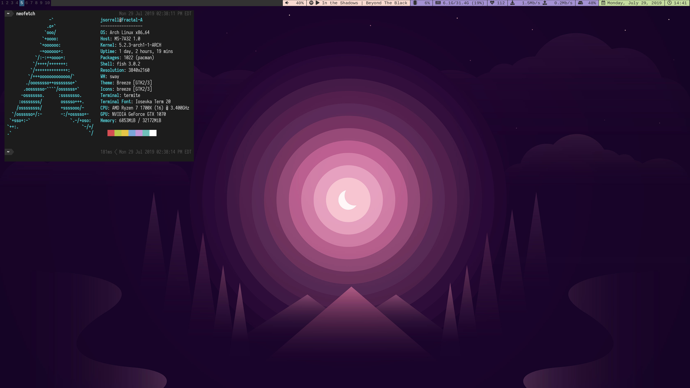

Jack's Dotfiles
========
Feel free to use whatever
-------------------------

### Contains configs for
- [`sway`](https://swaywm.org/)
- [`i3blocks`](https://vivien.github.io/i3blocks/)
- [`fish`](https://fishshell.com/) and [`oh-my-fish`](https://github.com/oh-my-fish/oh-my-fish)
- [`git`](https://git-scm.com/)
- [`tmux`](https://github.com/tmux/tmux)
- [`termite`](https://github.com/thestinger/termite/)
- [`gtk`](https://www.gtk.org/)

### Local config
#### Background
Uses `$HOME/.bg`

### Screenshot

